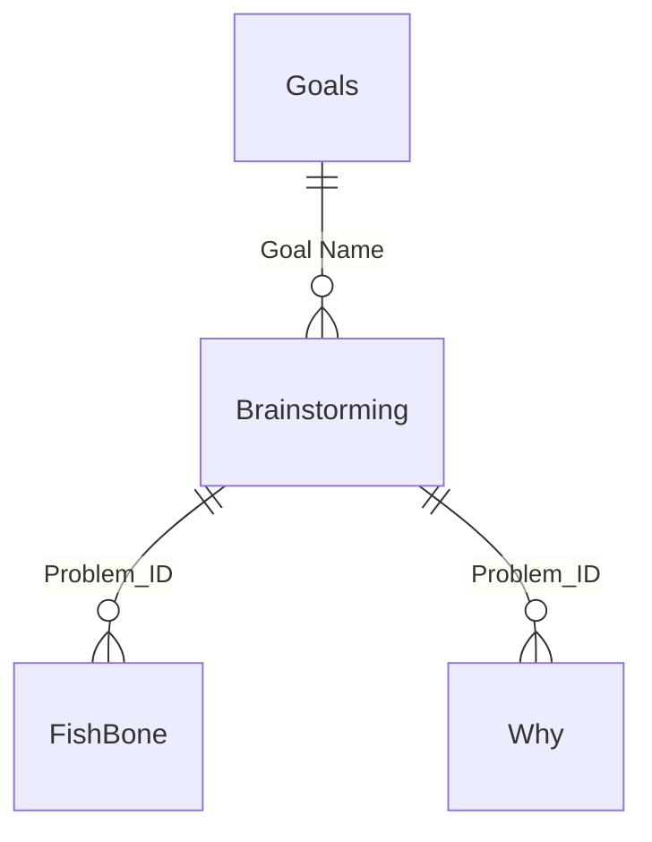

# RCA Power BI Portfolio Project — Root Cause Analysis Dashboard

An interactive Power BI dashboard implementing a full **Root Cause Analysis (RCA)** workflow: structured brainstorming → Fishbone (Ishikawa) diagramming → 3-tier Pareto (80/20) prioritization → 5-Why root cause drill-down.

---

## 📋 Overview

Most RCA exercises stop at "brainstorm some causes and pick one." This dashboard asks, at every level: **is this one of the vital few, or the trivial many?**

1. **Brainstorm & prioritize** problems against strategic goals (impact/urgency/effort scoring)
2. **Fishbone analysis** — categorize causes across 6 classic dimensions
3. **3-tier Pareto** — rank Category → Cause → Sub-Cause by frequency
4. **5-Why drill-down** — take the Pareto-justified sub-cause to its true root cause

---

## 🗂️ Data Model

| Table | Purpose |
|---|---|
| `Goals` | 4 strategic goals problems map against |
| `Brainstorming` | Problems per goal, scored for prioritization |
| `FishBone` | Cause/sub-cause breakdown per problem, across 6 categories |
| `Why` | 5-Why chains for a selected sub-cause |

**Note:** `FishBone` and `Why` are siblings — both link to `Brainstorming`, but not to each other. Selecting a cause in a Pareto chart doesn't auto-filter the 5-Why view; the sub-cause must be selected manually on both.

---

## 📁 Excel Data Source

All tables load from one Excel workbook, with each sheet formatted as a native Excel structured Table. New rows (goals, problems, causes, why-chains) auto-extend the table and pick up the correct data type on refresh — no manual schema work needed for routine entry.

---

## 📊 Pareto Analysis — 3 Tiers

| Tier | Ranks | Key measures |
|---|---|---|
| Category | 6 Fishbone categories by cause count | `Pareto Category Rank`, `Pareto Cumulative %`, `Vital Few Story` |
| Cause | Causes within selected category | `Cause Pareto Rank`, `Cause Pareto Cumulative %`, `Cause Vital Few Story` |
| Sub-Cause | Sub-causes within selected cause | `Sub Cause Pareto Rank`, `Sub Cause Pareto Cumulative %`, `Sub Cause Vital Few Story` |

Each tier uses tie-broken `RANKX` (frequency, then alphabetical) for reliable cumulative math, plus a dynamic storytelling measure, e.g.:

> *"One category alone drives 27% of every issue. Add the next 4, and you've covered 5 of 6 categories — enough to explain the vast majority of everything going wrong."*

> 💡 **DAX gotcha:** a measure isolating a single rank can't call another measure that uses `ALLSELECTED` on the same column internally — the inner `ALLSELECTED` resets the outer filter, silently giving wrong results. Compute the numerator/denominator directly instead.

---

## 🧮 Measure Library (43 measures)

- **Fishbone/5-Why:** `Fishbone_Head_Problem`, `*_Causes_With_Sub`, `Root Cause`, `Why Narrative`
- **Prioritization:** `Problem Score`, `Priority Score`
- **Counts:** `Total Fishbone Items`, `Total Goals`, `Distinct Problems`
- **Pareto (×3 tiers):** Rank, Cumulative Count, Cumulative %, Total-in-View, X-to-Reach-80%, Vital Few Summary/Story per tier

---

## 🖱️ How It Works

1. Review problems by `Priority Score` on the Brainstorming page
2. Select a problem → Fishbone diagram populates
3. Category Pareto chart shows which categories dominate → read `Vital Few Story`
4. Click top category → Cause Pareto chart narrows down
5. Click top cause → Sub-Cause Pareto chart identifies the highest-impact sub-cause
6. Manually select that sub-cause in the 5-Why view to see the full root-cause chain

This keeps every root-cause deep-dive **data-justified**, not arbitrary.

---

## 🖼️ Screenshots

- Main Screen RCA Dashboard.png
- ``
- ``
- ``
- ``
- ``

---

## 🛠️ Built With

Power BI Desktop · DAX · Microsoft Excel · Claude + `powerbi-modeling-mcp` (measure creation/debugging, DAX validation)

**Stats:** 4 goals · 10 problems · 15 Fishbone entries · 6 categories · 43 measures · 3-tier Pareto drill-down
